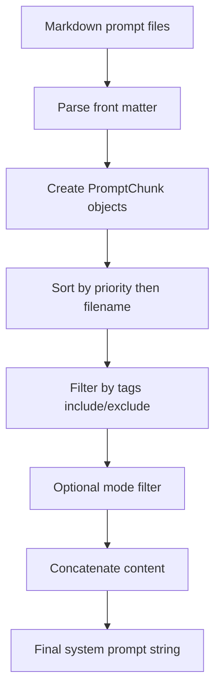
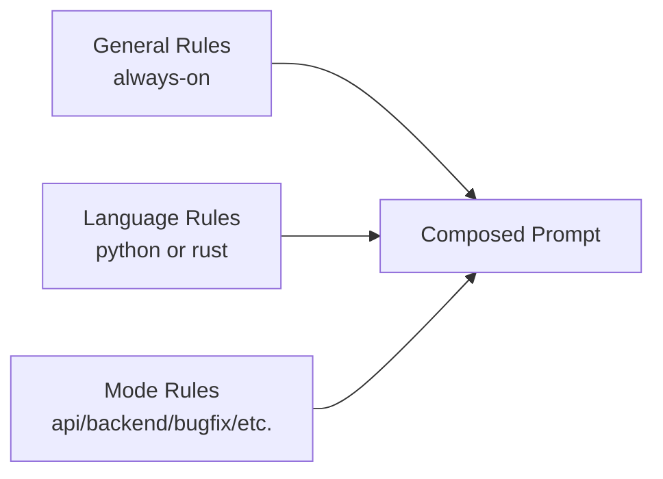

# black_cube_agents

A repository for building and evolving **agent instruction sets** as composable Markdown prompt chunks.

The project currently contains:

- A Rust crate scaffold (`src/main.rs`) that is still a placeholder.
- A Python utility (`refined_agents/create_prompts.py`) for loading and assembling prompt chunks.
- A curated prompt catalog under `refined_agents/prompts/system/...` organized by:
  - general engineering rules
  - language-specific rules (Python, Rust)
  - task modes (API, backend, bugfix, etc.)

## Why This Repo Exists

The intent is to treat prompt engineering like software engineering:

- break guidance into small, versioned modules
- assign metadata (`priority`, `tags`)
- compose final system prompts deterministically
- support different contexts (language, mode) without duplicating everything

## Repository Layout

```text
.
├── Cargo.toml
├── src/
│   └── main.rs
└── refined_agents/
    ├── create_prompts.py
    ├── test.sql
    └── prompts/
        ├── specific_specialist_rules/      # currently empty
        └── system/
            ├── general_developer_rules/
            ├── language_good_pratices/
            │   ├── python/
            │   └── rust/
            └── modes/
                ├── api/
                ├── backend/
                ├── bugfix/
                ├── data_pipeline/
                ├── refactor/
                └── test_generation/
```

## Prompt Model

Each prompt chunk is a Markdown file with optional front matter:

```yaml
---
id: python_defaults
priority: 60
tags: [python]
---
```

Then regular Markdown body content follows.

### Metadata Semantics

- `priority`: lower values are loaded first.
- `tags`: used for include/exclude filtering.
- `id`: identifier for humans and traceability.

If `priority` is missing, `create_prompts.py` tries to infer it from filename prefix (`010_...`).

## How Composition Works (Current Script)

`refined_agents/create_prompts.py` provides:

- `PromptChunk` dataclass
- `_parse_front_matter(md_text)`
- `load_chunks(*folders, root="agents/prompts")`
- `build_system_prompt(include_tags=("always",), exclude_tags=(), mode=None)`

### Composition Flow



### Rule Layering Model



## Important Current Status (Read This First)

The prompt files are deeply nested (`system/general_developer_rules`, `system/language_good_pratices/python`, etc.) and the generator now supports this layout using recursive Markdown discovery.

By default, prompts are loaded from `refined_agents/prompts` (via `DEFAULT_PROMPTS_ROOT`).

### Practical Impact

`build_system_prompt()` and the CLI now assemble the current catalog directly. Mode-specific files are filtered by selected task mode, and task presets apply include/exclude tags to keep generated prompts focused.

## Quick Start For Engineers

### 1) Understand the catalog

Start with these folders:

- `refined_agents/prompts/system/general_developer_rules`
- `refined_agents/prompts/system/language_good_pratices/python`
- `refined_agents/prompts/system/language_good_pratices/rust`
- `refined_agents/prompts/system/modes`

### 2) Run and iterate locally

Use Python 3.11+ (script uses modern typing syntax).

Generate a prompt directly from the terminal:

```bash
uv run --project refined_agents python refined_agents/create_prompts.py \
    --agent codex \
    --language python \
    --task api \
    --framework fastapi \
    --objective "Create a FastAPI API for customer CRUD with validation and tests" \
    --output data/fastapi_api_prompt.md
```

Inside `refined_agents/`, the equivalent command is:

```bash
python3 create_prompts.py \
    --agent codex \
    --language python \
    --task api \
    --framework fastapi \
    --objective "Create a FastAPI API for customer CRUD with validation and tests" \
    --output data/fastapi_api_prompt.md
```

Data pipeline example:

```bash
python3 refined_agents/create_prompts.py \
    --agent claude-code \
    --language python \
    --task data_pipeline \
    --objective "Build an idempotent pipeline to ingest CSV, validate schema, and publish curated parquet" \
    --output prompts/data_pipeline_prompt.md
```

Interactive mode (asks questions in terminal):

```bash
python3 refined_agents/create_prompts.py --interactive
```

If you prefer to print to stdout instead of writing a file, omit `--output`.

Project context is now optional and externalized:

- If you do not pass a project context source, prompts are generated without project context.
- Use `--project-context-path` to load project context from a local markdown file.
- Use `--project-context-url` to download project context from a URL.

Example with local project context:

```bash
uv run --project refined_agents python refined_agents/create_prompts.py \
    --agent codex \
    --language python \
    --task backend \
    --objective "Implement service layer for order lifecycle" \
    --project-context-path refined_agents/prompts/system/general_developer_rules/000_project_context.md \
    --output data/backend_prompt.md
```

### 2.1) Configure defaults via environment variables (Dynaconf)

The generator now uses Dynaconf and loads defaults from:

- `refined_agents/settings.toml`
- `refined_agents/.secrets.toml` (optional, gitignored)
- environment variables with prefix `REFINED_AGENTS_`

Example:

```bash
cd refined_agents
REFINED_AGENTS_AGENT=goose \
REFINED_AGENTS_LANGUAGE=python \
REFINED_AGENTS_TASK=data_pipeline \
uv run python create_prompts.py --objective "Create an ingestion pipeline with schema validation"
```

Minimal local experimentation from repository root using the library API:

```bash
python3 - <<'PY'
from refined_agents.create_prompts import build_system_prompt

# This call reflects current defaults; see caveat section in README.
result = build_system_prompt(include_tags=("always", "python", "backend"), mode="backend")
print(result[:1000])
PY
```

### 3) Extend rules safely

When adding a new prompt chunk:

- place it in the correct domain folder
- add front matter (`id`, `priority`, `tags`)
- keep one focused concern per file
- avoid duplicating existing rules

## Prompt Domains In This Repo

- **General developer rules**: reasoning strategy, code generation behavior, non-negotiables.
- **Python rules**: lint/type/test expectations, async/data guidance, backend/API defaults.
- **Rust rules**: safety/error/tooling/async defaults.
- **Modes**: overlays for specific tasks (bugfix, refactor, test generation, backend, API, data pipeline).

## Suggested Next Engineering Steps

1. Add automated tests for front matter parsing, mode detection, and tag filtering.
2. Add real examples under `specific_specialist_rules/`.
3. Add task presets for more frameworks/stacks (e.g., Django, Axum, Actix).
4. Replace placeholder Rust `main.rs` or document Rust role if intentionally reserved.

## Notes

- `test.sql` is currently empty.
- `specific_specialist_rules/` is currently empty.
- Rust crate is currently scaffold-only (`Hello, world!`).
