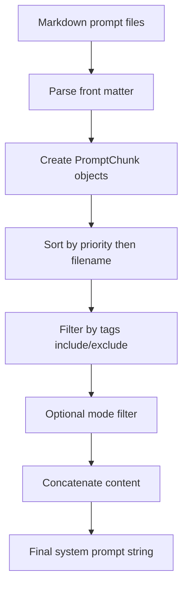
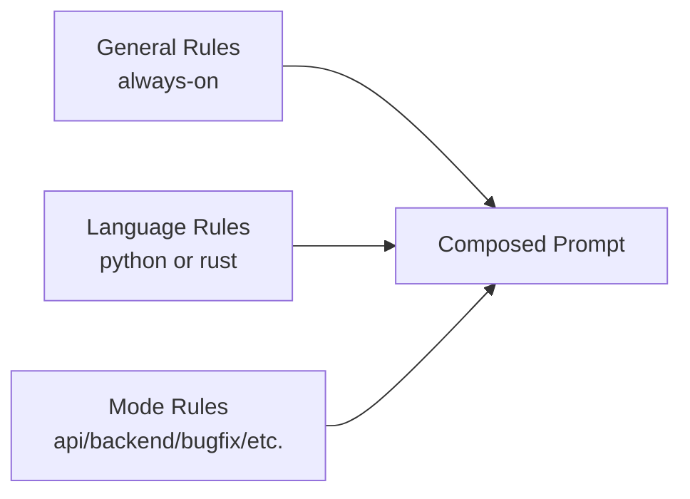

# black_cube_agents

A repository for building and evolving **agent instruction sets** as composable Markdown prompt chunks.

The project currently contains:
- A Rust crate scaffold (`src/main.rs`) that is still a placeholder.
- A Python utility (`refined_agents/create_prompts.py`) for loading and assembling prompt chunks.
- A curated prompt catalog under `refined_agents/prompts/system/...` organized by:
  - general engineering rules
  - language-specific rules (Python, Rust)
  - task modes (API, backend, bugfix, etc.)

## Why This Repo Exists

The intent is to treat prompt engineering like software engineering:
- break guidance into small, versioned modules
- assign metadata (`priority`, `tags`)
- compose final system prompts deterministically
- support different contexts (language, mode) without duplicating everything

## Repository Layout

```text
.
├── Cargo.toml
├── src/
│   └── main.rs
└── refined_agents/
    ├── create_prompts.py
    ├── test.sql
    └── prompts/
        ├── specific_specialist_rules/      # currently empty
        └── system/
            ├── general_developer_rules/
            ├── language_good_pratices/
            │   ├── python/
            │   └── rust/
            └── modes/
                ├── api/
                ├── backend/
                ├── bugfix/
                ├── data_pipeline/
                ├── refactor/
                └── test_generation/
```

## Prompt Model

Each prompt chunk is a Markdown file with optional front matter:

```yaml
---
id: python_defaults
priority: 60
tags: [python]
---
```

Then regular Markdown body content follows.

### Metadata Semantics

- `priority`: lower values are loaded first.
- `tags`: used for include/exclude filtering.
- `id`: identifier for humans and traceability.

If `priority` is missing, `create_prompts.py` tries to infer it from filename prefix (`010_...`).

## How Composition Works (Current Script)

`refined_agents/create_prompts.py` provides:
- `PromptChunk` dataclass
- `_parse_front_matter(md_text)`
- `load_chunks(*folders, root="agents/prompts")`
- `build_system_prompt(include_tags=("always",), exclude_tags=(), mode=None)`

### Composition Flow



### Rule Layering Model



## Important Current Status (Read This First)

The current prompt files are deeply nested (`system/general_developer_rules`, `system/language_good_pratices/python`, etc.), but `load_chunks` currently scans only `*.md` directly inside each selected folder.

Also, `load_chunks` defaults `root` to `agents/prompts`, while this repository stores prompts under `refined_agents/prompts`.

### Practical Impact

As-is, `build_system_prompt()` will not assemble the nested prompt catalog unless one of these is done:
- adjust `root` and recursive discovery logic in `create_prompts.py`, or
- flatten prompt files into the folder structure expected by the script.

This is the main onboarding caveat.

## Quick Start For Engineers

### 1) Understand the catalog

Start with these folders:
- `refined_agents/prompts/system/general_developer_rules`
- `refined_agents/prompts/system/language_good_pratices/python`
- `refined_agents/prompts/system/language_good_pratices/rust`
- `refined_agents/prompts/system/modes`

### 2) Run and iterate locally

Use Python 3.11+ (script uses modern typing syntax).

Minimal local experimentation from repository root:

```bash
python3 - <<'PY'
from refined_agents.create_prompts import build_system_prompt

# This call reflects current defaults; see caveat section in README.
result = build_system_prompt(include_tags=("always", "python", "backend"), mode="backend")
print(result[:1000])
PY
```

### 3) Extend rules safely

When adding a new prompt chunk:
- place it in the correct domain folder
- add front matter (`id`, `priority`, `tags`)
- keep one focused concern per file
- avoid duplicating existing rules

## Prompt Domains In This Repo

- **General developer rules**: reasoning strategy, code generation behavior, non-negotiables.
- **Python rules**: lint/type/test expectations, async/data guidance, backend/API defaults.
- **Rust rules**: safety/error/tooling/async defaults.
- **Modes**: overlays for specific tasks (bugfix, refactor, test generation, backend, API, data pipeline).

## Suggested Next Engineering Steps

1. Align `create_prompts.py` with current nested folder layout (recursive glob and root alignment).
2. Add tests for front matter parsing, sorting, and tag/mode filtering.
3. Add a small CLI entrypoint to generate prompt bundles by language + mode.
4. Add real examples under `specific_specialist_rules/`.
5. Replace placeholder Rust `main.rs` or document Rust role if intentionally reserved.

## Notes

- `test.sql` is currently empty.
- `specific_specialist_rules/` is currently empty.
- Rust crate is currently scaffold-only (`Hello, world!`).
